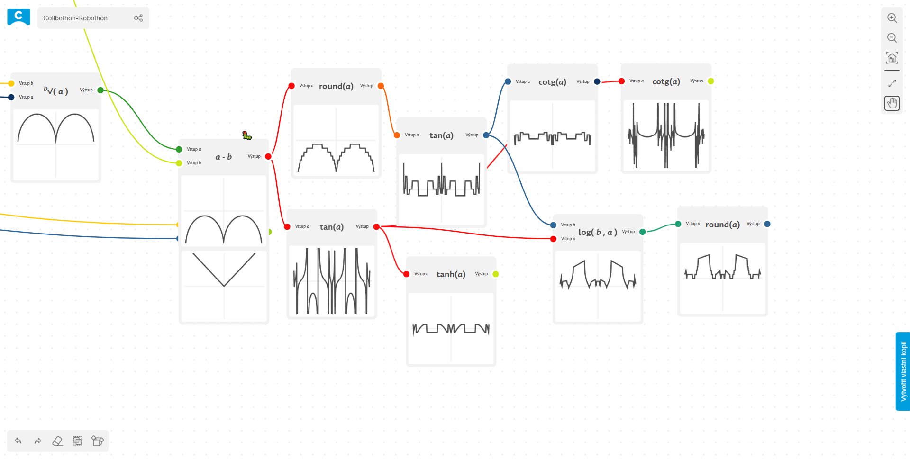

# 📈 Collboard function builder

<!--Badges-->

 
 
 
 
 
 
 

<!--/Badges-->

Function builder was created at hackathon Robothon 2021 as a **first external module** for [Collboard.com](https://www.npmjs.com/package/@collboard/modules-sdk/)

[ Create your own function builder board](https://collboard.com/new?redirect=1&modulesOn=@collboard/function-builder-tool)

## Links

-   https://youtu.be/gKEXOXSIoRc
-   https://collboard.com/8JmPkzKsDy2XWv6Hd
-   https://collboard.com/
